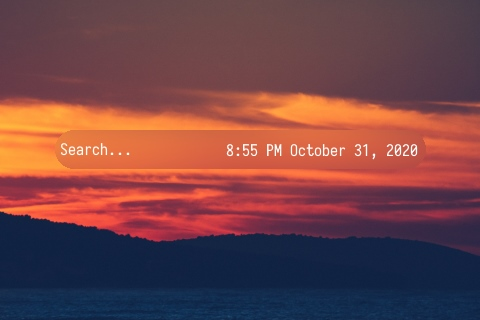
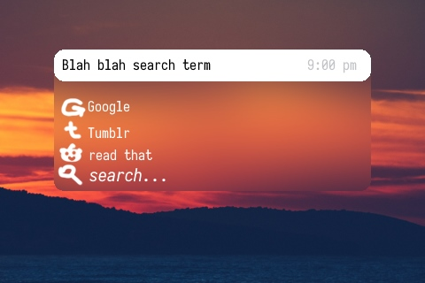
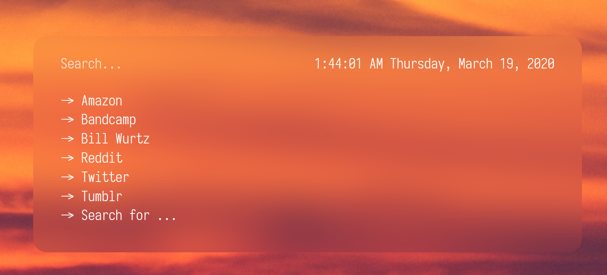

# NewestTab design

## Goals
* Quick minimal lightweight tab page.
* NewerTab background support
* Maybe browser extension version?
* Inspired by some tab pages I've seen on r/UnixPorn and r/StartPages, the ones with a search bar and a few bookmarks in columns below it.

## Features
* A sort of omnibar - of course like in chrome, but with user-selected keywords
* Maybe a browser extension that replaces your new tab with it and integrates bookmarks? -- This would not search through all your bookmarks (that'd be horrible), you'd just select a few to copy over.
* Same background-selection features as in NewerTab, with blurring done on-the-fly with "Javascript making an image object" and not CSS filters. This is for performance reasons. or maybe not do this?

## Three view modes
### Minimal

* Just the search bar in the center. When you search, a list below pops out with some bookmarks.

### Bookmarks

* Option to have a default list of bookmarks that shows up beneath the search bar.
* Ignore that "Search for..." it's broken and i fixed it already

### Classic?????
* All it is is Bookmarks with a big clock above the search bar
* Meant to emulate NewerTab.
* Maybe this is dumb and I shouldn't include it. Bookmarks mode is already pretty good and I don't want to deal with moving the clock out of the bar

## Specific things I have in mind
* ~~toggle for search bar to fill parent. otherwise it will have some padding that clearly says "I am not the entire parent"~~ see `bookmarks.png`
* ~~search bar initially glass but will transition to solid white when you start typing.~~
* ~~"Search..." text on left, current date/time on right.~~
* Maybe some basic favicon-kinda-thing with FontAwesome brands.svg and a short look-up table? With the kinda "white icons on colorful squares" thing? This also means the look-up table will have color data
* Color picker, when right-clicked, will change to a text field to allow for copying colors much more easily.
* Oof, columns will be fun to design
